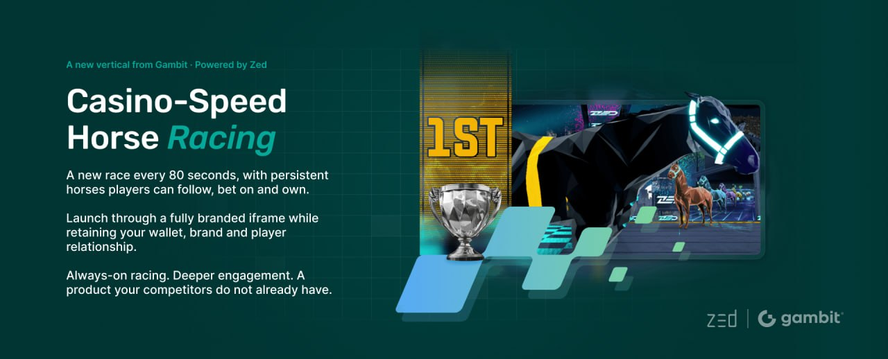

# Welcome to ZED Racing

<figure><figcaption></figcaption></figure>

## Welcome to ZED Racing

ZED Racing is a casino-speed horse racing platform. A new race starts every 80 seconds, around the clock. You can:

* Bet on any race, whether you own a horse in it or not.
* Own horses by buying syndicate packs, building a stable, and watching them race.
* Climb leaderboards for weekly and monthly rewards.

Two things make ZED different from traditional racing:

1. It never sleeps. Races run continuously. There is always one running and one queued.
2. Horses are persistent. Every horse in the pool is a real, named entity with a career record. Over time you learn their strengths.

**Season One note.** ZED Racing is in public beta. The horse pool is capped at 1,080 horses. Win, Place, Multi, Trifecta, Supafecta, and Dutch bets are all available (see [Placing a Bet](05-placing-a-bet.md)). An expanded horse pool and further features are planned for later seasons.
